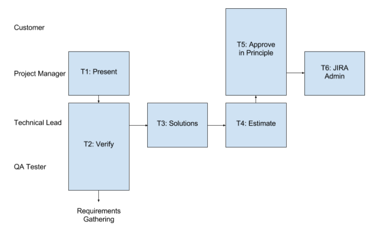

## Purpose
- To verify requirements
- To establish possible solutions to meet the requirements
- To provide the pros, cons and estimated effort required for each proposed solution

## Roles
- **Project Manager**
	- The project manager for the specific client
- **Technical Lead**
	- The technical owner of the part of the system which is to be changed (if the development is wide ranging multiple technical leads may be required)
- **QA Tester**
	- A member of the QA team (ideally someone who is familiar with the area of the system being changed) NOTE: with minimal QA resource this role may also be filled by the **Technical Lead**
- **Customer**
	- The stakeholder at the client's business for the required changes

## Entry Criteria
- A completed requirements document as per the [Requirements Gathering Process][1]
- **Project Manager** to have clear understanding of requirements and motivations for the proposed development

## Tasks
T1. 	Present: **Project Manager** to present the proposed development

T2. 	Verification: As per verification points below

T3.		Solutions: **Technical Lead** to offer solution(s) (as many as they think appropriate) and provide pros and cons for each. They should also highlight which solution is their preferred option.

T4. 	Estimate: **Technical Lead** to provide a rough estimate of effort involved for each proposed solution

T5. 	Approve in Principle: **Project Manager** to present suggested solutions (with an emphasis on the **Technical Lead**'s preferred solution) to the **Customer** who will then pick their preferred option

T6. 	JIRA Adim: **Project Manager** moves ticket into specification status

		

## Verification
V1.		Testability: **QA Tester** to verify that all requirements are testable 

V2. 	Requirement Definition: **Technical Lead** to verify that the customer has not proposed a solution in the requirements (the requirements only define WHAT not HOW)

V3. 	Success Criteria: **Technical Lead** to verify that there are clear success objectives for the development

V4. 	Viability: **Technical Lead** to verify that all requirements are possible to achieve and don't conflict with the existing system functionality

## Exit Criteria
- If verification criteria are **not** met then return to [Requirements Gathering][1]
- If verification criteria are met then the following must also be met to proceed to [Specification][2]:
	- **Technical Lead** has fully understood **Customer**'s requirements and motivations
	- All parties are agreed on the solution which will be used to meet the requirements
	- **Technical Lead** has provided a rough estimate of development effort for the preferred solution
	- Any limitations of the soultion have been understood and presented to the customer
	- JIRA status should be *Specification*

## Deliverables
D1. A final solution for the proposed development

D2. A development effort estimate for the proposed solution

## Quality Records 
N/A

[1]:/DevelopmentTeamProcess/content/SoftwareDevelopment-subtopics/RequirementsGathering
[2]:/DevelopmentTeamProcess/content/SoftwareDevelopment-subtopics/SpecificationWriting