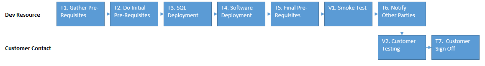

## Purpose
- To update a clients live environment so the customer can benifit from the developments and fixes we have done.

## Roles
- **Dev Resource**
	- Senior member of the development team in charge of the deployment.
- **Project Manager**
	- Member of the Project Team responsible for the customer.
- **Customer Contact**
	- A nominated point of contact for the customer.

## Entry Criteria
- All Developments in Jira are marked as *Passed Test*.
- All Pre-Release issues in Jira are marked as *Resolved*.
- All Zendesk tickets in Jira as marked as *Passed Test*.
- **Customer Contact** has returned a signed release form to the **Project Manager**.
- A date and time has been agreed by the **Dev Resource**, **Project Manager** and **Customer Contact**.

## Tasks
T1. Gather Pre-Requisites: **Dev Resource** collates a list of all release pre requisites.

T2. Do Initial Pre-Requisites: **Dev Resource** enacts out any release pre-requisites that can be done before a release.

T3. SQL Deployment: **Dev Resource** at the alloted time kicks off the SQL deployment

T4. Software Deployment:  **Dev Resource** deploys the Software

T5. Final Pre-requisites:  **Dev Resource** completes the remaining pre-req that coukd not be dont before deployment

T6. Notify Other Parties:  **Dev Resource** notifies the **Project Manager** and **Customer Contact** that the deployment has been completed.

T7. Customer Sign Off:  **Customer Contact** signs off the release 

## Verification
V1.	Smoke Test: **Dev Resource** carries out a first pass to make sure the deployment has not caused any catastrophic issues

V2.	Customer Testing: **Customer Contact** reports any issues with the system via Zendesk

## Exit Criteria
- The live environement has been updated
- The **Customer Contact** has signed off the release

## Deliverables
- All developments and fixes are devlivered to the live environment.

## Quality Records 
N/A